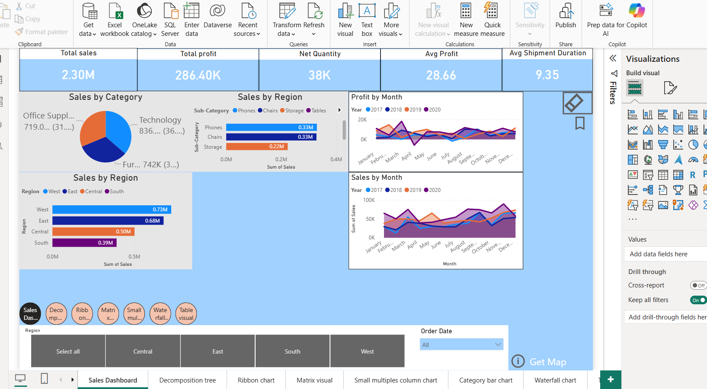

# Sample Superstore Sales Analysis Dashboard

## Project Overview

This Power BI dashboard provides an interactive analysis of sales, profit, customer segments, and regional performance using the Sample Superstore dataset. The dashboard helps identify business trends, top-performing categories, and areas that need improvement.

## Tools Used

* Power BI
* Power Query
* DAX
* Excel

## Key Insights

* Sales and Profit Analysis
* Category-wise Performance
* Regional Sales Trends
* Customer Segment Analysis
* Top Products and Customers
* Order and Shipping Performance

## Dashboard Preview

## Files Included

* sample superstore powerbi.pbix
* Dashboard.png
* README.md

## Project Objective

The objective of this project is to transform raw sales data into meaningful business insights through data modeling, visualization, and interactive reporting in Power BI.
